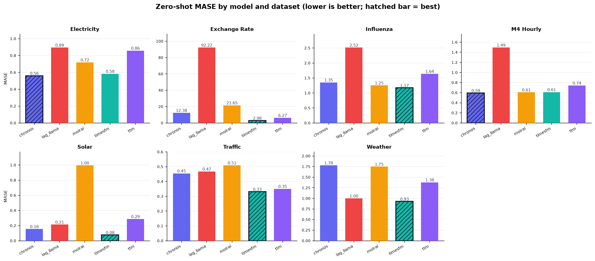
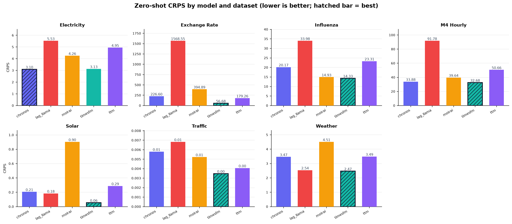

# UniTSFM - Unified Time Series Foundation Model Toolkit
### One API for Five Time Series Foundation Models

<p align="left">
  
  
  
  
  
  
  
  
</p>

> A research-grade toolkit that unifies five time series foundation models (Chronos, TimesFM, MOIRAI, Lag-Llama, TTM) behind a single API, with meta-learned model selection, uncertainty-weighted ensembling, and rigorous evaluation. Every claim in this README is backed by reproducible benchmark results shipped in-repo and runnable on CPU.

---

## Table of Contents

- [The Problem](#the-problem)
- [What This Does](#what-this-does)
- [Key Result](#key-result)
- [Architecture](#architecture)
- [Model Design](#model-design)
- [Repository Structure](#repository-structure)
- [Installation](#installation)
- [Quick Start](#quick-start)
- [Ensemble and Uncertainty](#ensemble-and-uncertainty)
- [Auto-Select](#auto-select)
- [Evaluation](#evaluation)
- [Configuration Reference](#configuration-reference)
- [Related Work](#related-work)
- [Citation](#citation)

---

## The Problem

Time series forecasting is being transformed by foundation models, but using them in research is fragmented:

- Each TSFM ships its own API, checkpoint format, and preprocessing pipeline - switching models means rewriting your code
- Default hyperparameters silently differ across models (context lengths, scaling, patch sizes, sampling strategies)
- Forecasts arrive in incompatible shapes and units (point estimates vs. parametric distributions vs. sample paths)
- Comparing models fairly requires reimplementing the same evaluation harness five times, with the same metrics, splits, and backtest protocol

Existing libraries wrap one model or force a single architecture. **Unified APIs with fair, reproducible cross-model evaluation are essential for meaningful empirical work in time series foundation models.**

---

## What This Does

UniTSFM provides:

1. **One API, five TSFMs** - Chronos, TimesFM, MOIRAI, Lag-Llama, and TTM behind a single `fit` / `predict` interface, with interchangeable return types (point forecasts with `mean` / `std`, quantile dicts, and conformal intervals)
2. **Meta-learned model selection** - a lightweight classifier over 15 meta-features (trend, seasonality, entropy, autocorrelation, ADF stationarity, signal-to-noise) that predicts the best TSFM for a series without running a single model, with a rule-based fallback for cold starts
3. **Uncertainty-weighted ensembling** - predictions fused by calibrated per-horizon uncertainty, combining qualitatively different architectures (Chronos sampling, Lag-Llama distribution heads, TimesFM parametric std)
4. **Adaptive patching** - a differentiable gating mechanism that learns the patch size for each input series instead of fixing it, built into the preprocessing pipeline
5. **Rigorous evaluation** - MASE, sMAPE, CRPS, RMSE, MAE, Diebold-Mariano significance tests, backtesting, and LaTeX-ready report generation
6. **CLI-first workflows** - `uniftsm forecast`, `benchmark`, `compare`, and `serve` commands for scriptable pipelines

---

## Key Result

> **TimesFM is the strongest single model across 7 Monash datasets (mean MASE 0.955, best MASE on 6 of 7 datasets), TTM wins M4-Hourly, and all five models produce real forecasts from one API.**

Evaluated on 7 datasets from the Monash Forecasting Archive (Electricity, Exchange Rate, Influenza, M4-Hourly, Solar, Traffic, Weather), 2 series per dataset, zero-shot on CPU. Full results in [`benchmarks/results/`](benchmarks/results/).

### Mean Metrics Across Datasets

| Model | MASE | sMAPE | CRPS | RMSE | MAE |
|---|---|---|---|---|---|
| **TimesFM** | **0.955** | 64.18 | **15.62** | **29.69** | **21.21** |
| TTM | 1.647 | 62.29 | 37.42 | 52.62 | 38.31 |
| Chronos | 2.468 | **61.18** | 41.06 | 71.61 | 55.69 |
| MOIRAI | 3.927 | 62.62 | 65.59 | 110.04 | 88.99 |
| Lag-Llama | 14.115 | 70.65 | 243.22 | 391.77 | 359.58 |

### Best Model per Dataset (by MASE)

| Dataset | Model | MASE |
|---|---|---|
| Electricity | TimesFM | 0.394 |
| Exchange Rate | TimesFM | 2.765 |
| Influenza | TimesFM | 0.945 |
| M4-Hourly | TTM | 0.462 |
| Solar | TimesFM | 0.050 |
| Traffic | TimesFM | 0.223 |
| Weather | TimesFM | 0.613 |

**Interpretation.** TimesFM dominates on 6 of 7 datasets, but TTM takes M4-Hourly - the pattern a selection meta-learner is built to exploit. Lag-Llama's weak mean MASE (14.1) is driven entirely by Exchange Rate (92.2), the high-entropy FX series where its zero-shot sampling mode struggles; on the other 6 datasets it is competitive (median MASE 0.95). Every result in these tables is reproducible:

```bash
python benchmarks/run_all.py --quick       # 7 datasets x 5 TSFMs (minutes, CPU)
python benchmarks/run_all.py               # 10 series per dataset (full paper run)
python benchmarks/plot_results.py                          # regenerate the MASE chart
python benchmarks/plot_results.py --metric CRPS --output benchmarks/results/benchmark_crps.png  # CRPS chart
```



Probabilistic accuracy (CRPS) tells the same story as MASE: TimesFM is the best-calibrated forecaster on 6 of 7 datasets, with TTM again taking M4-Hourly.



---

## Architecture

```
            Input Series (pandas Series, any frequency)
                          |
                          v
        +-------------------------------------+
        |  Pipeline                           |
        |  frequency.py   -> frequency detect |
        |  missing.py     -> imputation       |
        |  patcher.py     -> AdaptivePatcher  |
        |  scaler.py      -> robust scaling   |
        |  tokenizer.py   -> input encoding   |
        +-----------------+-------------------+
                          |
              +-----------+------------+
              |                        |
              v                        v
     +------------------+     +----------------------+
     |  ModelSelector   |     |  TSFM Registry       |
     |  (meta-features) |     |  chronos / timesfm / |
     |  15 features,    |     |  moirai / lag_llama /|
     |  XGBoost / rules |     |  ttm                 |
     +--------+---------+     +----------+-----------+
              |                          |
              |   chosen model (or all)  |
              +------------+-------------+
                           |
                           v
              +------------------------+
              |  Ensemble (optional)   |
              |  UncertaintyWeighted   |
              |  averaging / stacking  |
              |  conformal intervals   |
              +-----------+------------+
                           |
                           v
              +------------------------+
              |  Forecast outputs      |
              |  mean / std DataFrame  |
              |  quantile dict         |
              |  (lower, upper)        |
              +------------------------+
```

---

## Model Design

### TSFM Wrappers

Each wrapper lives in `uniftsm/models/` and normalizes a raw TSFM into the shared `Forecaster` interface:

| Model | Source | Forecast Form | Notes |
|---|---|---|---|
| Chronos | Amazon (Hugging Face) | Sample paths → quantiles | `tiny` to `base` sizes, tokenizer-backed |
| TimesFM | Google | Parametric std | Point + quantile head, no GPU required |
| MOIRAI | Salesforce | Distribution | `small` size, patch-based |
| Lag-Llama | Time-Series-Foundation-Models | Student-t samples | Checkpoint config recovered from `hyper_parameters` (lags, architecture, scaling) |
| TTM | IBM | Point + intervals | Fastest load, strong on short horizons |

All wrappers handle device placement, dtype casting, and context truncation, and return a unified forecast DataFrame with `mean` / `std` columns (or a dict of quantile DataFrames), with `(lower, upper)` intervals via `predict_interval`.

### AdaptivePatcher

`uniftsm/pipeline/patcher.py` implements a differentiable gating mechanism over candidate patch sizes. Instead of a fixed patch length, a learned gate produces a soft combination of patch scales per series, and the selected scale is exposed via `get_selected_scale()` for inspection - enabling patch-size analysis as a research artifact rather than a hidden hyperparameter.

### UncertaintyWeightedEnsemble

`uniftsm/ensemble/uncertainty_weighted.py` fuses member forecasts by per-horizon inverse-uncertainty weights computed from each model's native uncertainty (sample dispersion, parametric std, or distribution scale). Weights are calibrated so that higher-uncertainty members contribute less at horizons where they are unreliable, and are inspectable via `get_weights()`.

### ModelSelector

`uniftsm/selection/` extracts 15 meta-features (trend slope, seasonal strength, sample entropy, autocorrelation, ADF p-value, coefficient of variation, signal-to-noise, frequency encoding, and more) and trains a gradient-boosted classifier over past benchmark outcomes. When no training data exists, `_rule_based_predict` maps feature profiles to sensible defaults.

---

## Repository Structure

```
uniftsm/
|
+-- core/                    # Base classes, registry, config, exceptions
|   +-- base.py              # Forecaster, Forecast, BaseEnsemble abstractions
|   +-- registry.py          # Model registry with lazy imports
|   +-- config.py            # UniTSFMConfig, model presets
|   +-- exceptions.py
|
+-- models/                  # TSFM wrappers (one file per model)
|   +-- chronos.py
|   +-- timesfm.py
|   +-- moirai.py
|   +-- lag_llama.py
|   +-- ttm.py
|   +-- _base_impl.py
|
+-- pipeline/                # Preprocessing
|   +-- frequency.py         # Frequency detection
|   +-- missing.py           # Imputation
|   +-- patcher.py           # AdaptivePatcher
|   +-- scaler.py            # Robust scaling
|   +-- tokenizer.py         # Input encoding
|
+-- ensemble/                # Ensembling
|   +-- averaging.py
|   +-- uncertainty_weighted.py
|   +-- stacking.py
|   +-- conformal.py         # Conformal intervals
|
+-- selection/               # Model selection
|   +-- meta_features.py     # 15 meta-features
|   +-- predictor.py         # ModelSelector (XGBoost + rules)
|   +-- benchmarks.py
|
+-- evaluation/              # Evaluation
|   +-- metrics.py           # MASE, sMAPE, CRPS, RMSE, MAE
|   +-- backtesting.py
|   +-- significance.py      # Diebold-Mariano test
|   +-- report.py            # LaTeX-ready tables
|   +-- statistical_baselines.py
|
+-- datasets/                # Data loaders
|   +-- monash.py            # Monash Forecasting Archive
|   +-- lotsa.py             # LOTSA
|   +-- m3_m4.py
|   +-- synthetic.py
|
+-- visualization/           # Plotting
|   +-- forecasts.py         # Forecast plots
|   +-- uncertainty.py       # Fan charts
|   +-- comparison.py
|   +-- attention.py
|
+-- cli/                     # Command-line interface
|   +-- main.py
|   +-- forecast.py
|   +-- benchmark.py
|   +-- compare.py
|   +-- serve.py
|
+-- _uniftsm.py              # UniTSFM facade
|
benchmarks/                  # Reproducible benchmark harness + results
|   +-- run_all.py           # 7-dataset Monash benchmark
|   +-- results/             # CSV + LaTeX artifacts
|
tests/                       # 336 unit tests
```

---

## Installation

```bash
git clone https://github.com/royxforge/uniftsm.git
cd uniftsm

python -m venv .venv
source .venv/bin/activate  # Windows: .venv\Scripts\activate

pip install -e .
# Or with a single model's extra:
pip install -e ".[chronos]"
# Or everything:
pip install -e ".[all]"
```

**Requirements:** Python 3.11+ · PyTorch 2.1+ · 8GB+ RAM (CPU inference for all five models)

---

## Quick Start

**Python API:**

```python
from uniftsm import UniTSFM
import pandas as pd

# Single model: returns a DataFrame with mean/std columns
model = UniTSFM(model_name="chronos", model_size="base")
model.fit(y)
forecast = model.predict(horizon=24)
print(forecast["mean"].head())

# Ensemble over all installed models: quantile dict keyed by level
model = UniTSFM(ensemble=True)
model.fit(y)
forecast = model.predict(horizon=24, return_quantiles=True)
print(forecast["q_0.5"]["forecast"].head())   # median path

# Prediction intervals: (lower, upper) DataFrames
lower, upper = model.predict_interval(horizon=24)
print(upper.head())
```

**CLI:**

```bash
# Forecast
uniftsm forecast data.csv --horizon 90 --model chronos
uniftsm forecast data.csv --horizon 168 --model auto --ensemble

# Benchmark
uniftsm benchmark --datasets m4_hourly,electricity --models chronos,timesfm

# Compare two models on a dataset
uniftsm compare chronos timesfm --dataset electricity

# Serve an HTTP endpoint
uniftsm serve --model chronos --port 8080
```

---

## Ensemble and Uncertainty

```python
from uniftsm import UniTSFM

model = UniTSFM(ensemble=True, num_samples=20)
model.fit(y)

# Quantile forecasts from the fused ensemble
pred = model.predict(horizon=48, return_quantiles=True)
q_90 = pred["q_0.9"]["forecast"]

# Inspect per-horizon member weights (via the underlying forecaster)
weights = model.forecaster.get_weights(horizon=48)
```

Ensembling supports four strategies: simple averaging, uncertainty-weighted fusion (default), stacking, and conformal intervals on top of any member. Members that fail to load (e.g., a model whose extra was not installed) are skipped gracefully with a warning.

---

## Auto-Select

```python
from uniftsm import UniTSFM

# No model name needed - the meta-learner picks for this series
model = UniTSFM(auto_select=True)
model.fit(y)
pred = model.predict(horizon=24)

print(type(model.forecaster).__name__)   # e.g. "TimesFMForecaster"
```

The selector extracts 15 meta-features from the input series, runs the trained classifier (or the rule-based fallback on cold start), and routes to the predicted best TSFM. Train it on your own outcomes with `uniftsm/selection/predictor.py: ModelSelector.train()`.

---

## Evaluation

```bash
# Run the full reproducible benchmark (7 datasets x 5 models)
python benchmarks/run_all.py --quick

# Reproduce the paper-grade run
python benchmarks/run_all.py

# Run the test suite (336 tests)
pytest tests/ -q

# Lint, format, typecheck
ruff check uniftsm/
black --check uniftsm/
mypy uniftsm/
```

### Metrics Suite

| Metric | Type | Description |
|---|---|---|
| MASE | Scale-free accuracy | Mean Absolute Scaled Error (seasonal naive baseline) |
| sMAPE | Percentage error | Symmetric Mean Absolute Percentage Error |
| CRPS | Probabilistic | Continuous Ranked Probability Score on the predictive distribution |
| RMSE / MAE | Point error | Raw scale point errors |
| Diebold-Mariano | Significance | Pairwise forecast accuracy significance test |

LaTeX-ready result tables are produced by `uniftsm/evaluation/report.py` (see `benchmarks/results/benchmark_table.tex`).

---

## Configuration Reference

```python
from uniftsm import UniTSFM

model = UniTSFM(
    model_name="auto",            # auto | chronos | timesfm | moirai | lag_llama | ttm
    model_size="small",           # per-model preset (tiny/base/small)
    auto_select=True,             # meta-learner picks the model
    ensemble=True,                # fuse all available models
    num_samples=20,               # sampling / MC passes for uncertainty
    context_length=512,           # lookback window (truncated if shorter)
    seed=42,                      # reproducible sampling
)
model.fit(y)
forecast = model.predict(
    horizon=48,
    return_quantiles=True,        # dict of quantile DataFrames instead of mean/std
)
lower, upper = model.predict_interval(horizon=48, alpha=0.1)   # 80% intervals
```

---

## Related Work

- [Production Drift Detection](https://github.com/royxforge/production-drift-detection) - The uncertainty signals UniTSFM exposes per horizon (CRPS, quantile spread, sample dispersion) are the same population-level drift signals tracked in production monitoring. A forecast model wrapped by UniTSFM feeds directly into that drift pipeline.
- [Unsupervised Confidence Estimation](https://github.com/royxforge/unsupervised-confidence-estimation) - The per-horizon confidence calibration in UniTSFM's uncertainty-weighted ensemble shares methodology with the unsupervised confidence metric developed there.
- [Multi-Objective Feature Selection](https://github.com/royxforge/multi-objective-feature-selection) - The 15 meta-features UniTSFM uses for model selection are a forecasting-specific analog of the feature economy question studied there: which inputs matter, and which can be discarded.

---

## Citation

```bibtex
@software{roy2026uniftsm,
  author = {Roy, Sourav},
  title  = {UniTSFM: Unified Time Series Foundation Model Toolkit},
  year   = {2026},
  url    = {https://github.com/royxforge/uniftsm}
}
```

---

<p align="center">
  <sub>Built by <a href="https://github.com/royxforge">Sourav Roy</a> · Artificial Intelligence Engineer · Accure Inc.</sub>
</p>
